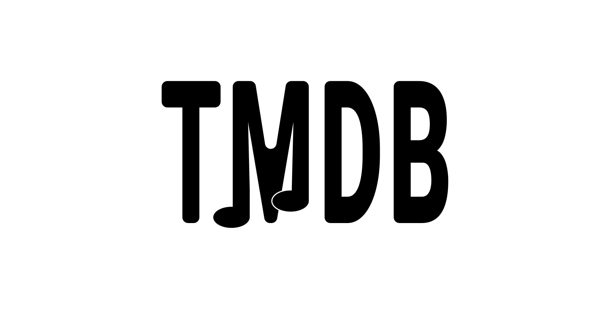

<body>

# [Travis-Music-Database](https://travis-music-database.appwrite.network/)
A database of my music, music I listen to, and music in general.

This site is a work in progress...

Here are planned features...

## Music Timelines
A way to look at popular music throughout the years.

## Easy Links
An easy way to share links that will show multiple places to listen to songs and see artists and albums.

## Listening Statistics
Ways to view your listening statistics and/or share them with the world or just friends. And also a way to view aggregate music data from all our users.

## Music Details
A way to see a lot of details about songs, artists, and albums.

## Synced Lyrics
A way to upload and retrieve synced lyrics.

## Music Analysis
A deep analysis of music.

## Music Maps
See where music is popular over time.

## Music APIs
APIs for accessing the information below...
- Aggregate listening data/statistics
- Authenticated User Data
- Easy Links & Access to other platforms links and content ids
- Synced Lyrics
- Geographic Data
- Music Analysis
- Importing Authenticated User Music Data

All of this is free except for APIs.

APIs are free for non-commercial use.

Our APIs can be used for commercial uses with payment.

Synced Lyrics API is always free.

Authenticated Data may cost money depending on how it is used; however, it is always free for non-commercial use.

APIs will work well with other APIs such as Spotify, Apple Music, and MusicBrainz.

All data that we display using other APIs will not be available through our API; however, you can use our API and its documentation to figure out how to access this info using these APIs yourself.
</body>